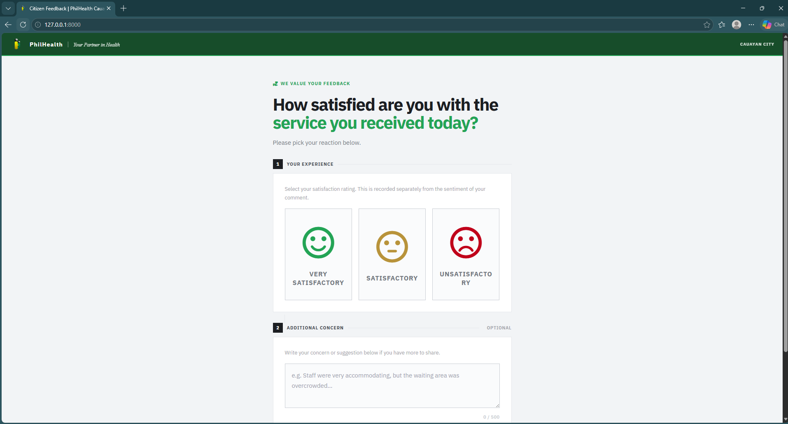
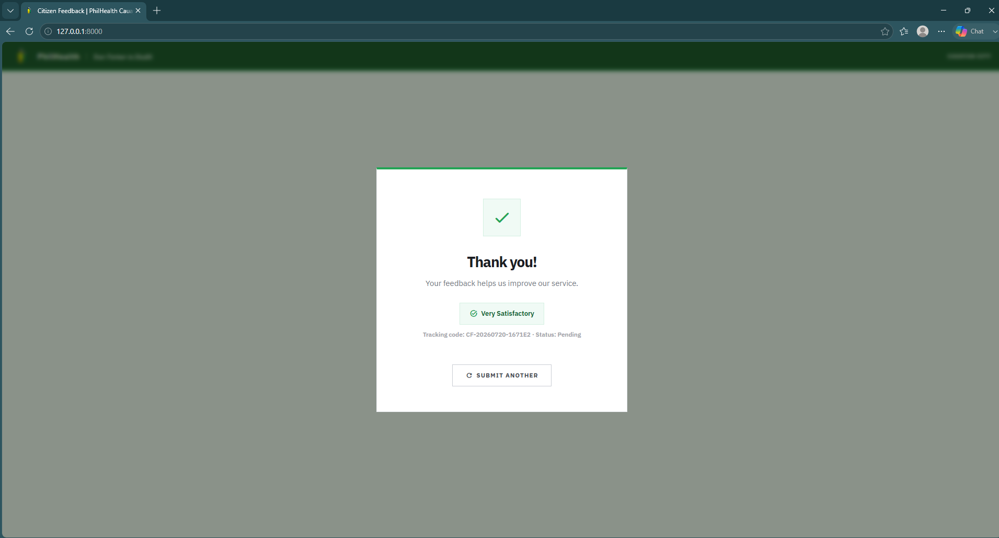
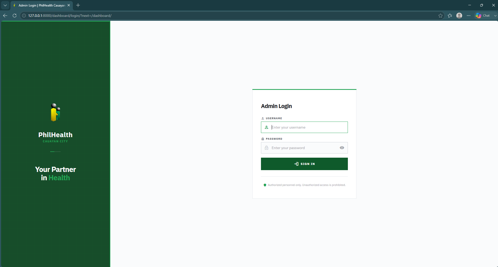
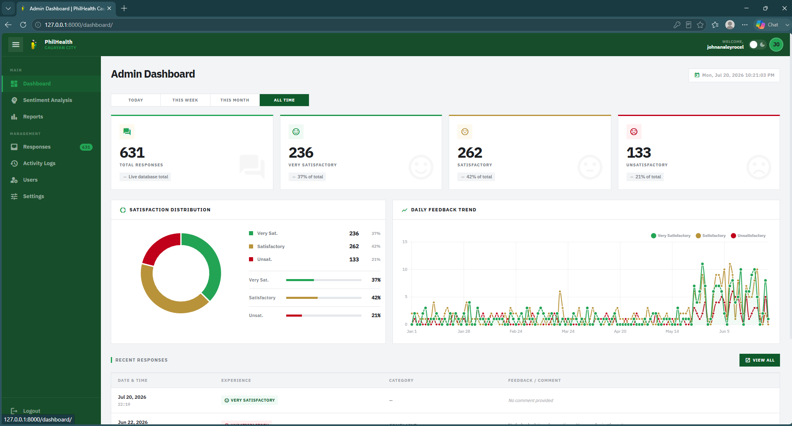
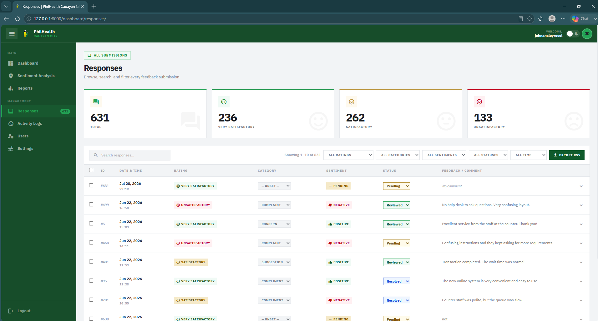
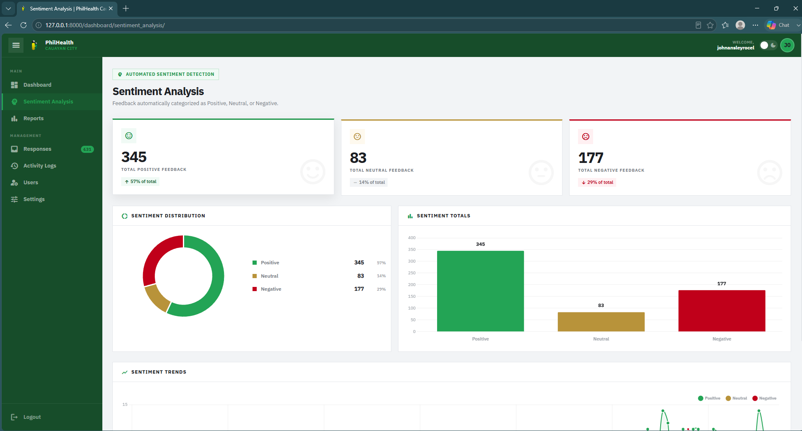
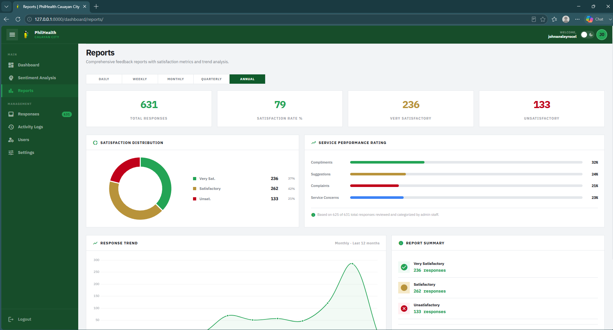
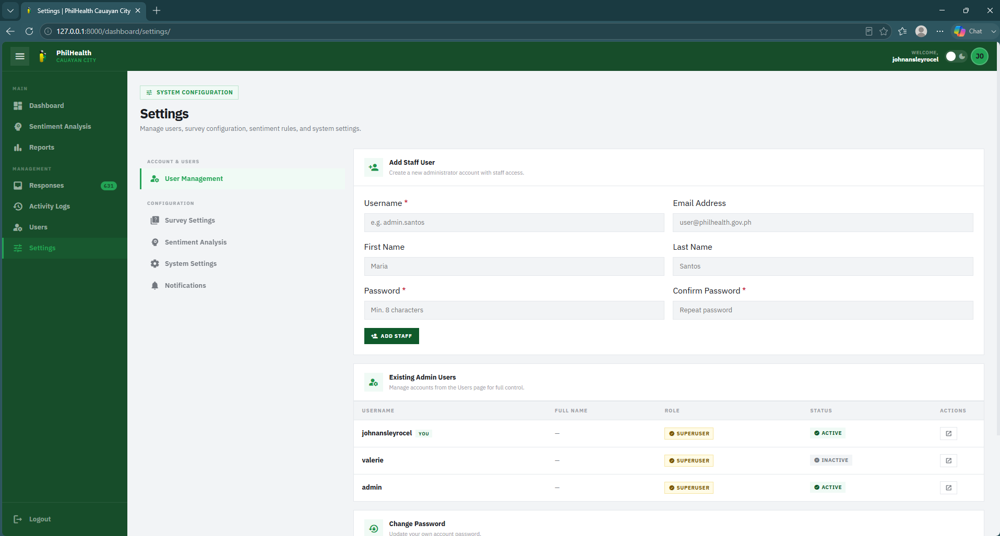

# Citizen Feedback and Sentiment Analysis System
> A modern, AI-powered feedback classification and response platform designed for local government agencies (PhilHealth Cauayan City).
test
This repository contains a full-stack Django application that bridges the gap between public service feedback collection and administrative action. By combining an intuitive public submission workflow with an offline Machine Learning pipeline, the system automatically classifies the sentiment of citizen comments to surface urgent concerns instantly. Administrators are equipped with a comprehensive dashboard containing trends, analytics, action logs, granular reports, and database utilities.

---

## Portfolio UI Previews

The screenshots below showcase the user interfaces and administrative tools of the system:

### Public-Facing Portal

*Figure 1: Step-by-step form for citizens to log experience ratings and comments.*

---

### Feedback Submission Success Modal

*Figure 2: Success modal displaying unique tracking code after a successful submission.*

---

### Admin Login Page

*Figure 3: Secure login portal for administrative staff.*

---

### Administrative Dashboard

*Figure 4: Main analytics dashboard showing metrics, daily/weekly stats, and feedback trends.*

---

### Responses and Actions Management

*Figure 5: Table interface to update statuses, assign categories, and add internal notes/replies.*

---

### Sentiment Analytics

*Figure 6: Real-time sentiment metrics (Positive, Neutral, Negative) and trend over time.*

---

### Periodical Performance Reports

*Figure 7: Detailed tabular breakdowns of experience and categorization over custom intervals.*

---

### Database and System Settings

*Figure 8: Interface for database backup/restore operations, user accounts, and batch sentiment processing.*

---

## Core Features

### Public-Facing Feedback Submission
- **Structured Submission**: Collects structured Service Quality Dimensions (SQD) ratings using official 6-point scale options (😠 Strongly Disagree, 🙁 Disagree, 😐 Neither Agree nor Disagree, 🙂 Agree, 😃 Strongly Agree, N/A Not Applicable) along with detailed feedback comments.
- **Unique Tracking Code**: Generates an immutable, human-readable identifier (e.g., CF-YYYYMMDD-[HEX]) upon submission for tracking.
- **AJAX Driven**: High-fidelity modal success screen and instant code generation without page reloads.

### Offline Machine Learning Sentiment Classification
- **Random Forest Classifier**: Features a pre-trained scikit-learn model (random_forest_sentiment.pkl) capable of predicting comment sentiments offline.
- **Deterministic Text Processing**: Cleans and normalizes text byte-for-byte identically to the training set:
  1. Lowercase normalization.
  2. Non-alphabetic character exclusion.
  3. Word tokenization.
  4. Snapshot-based English Stopword removal.
  5. Snowball stemming.
- **Batch Re-Analysis**: Built-in admin utility to re-run predictions across historical entries.

### Administrative Dashboard and Management
- **Key Metrics**: Interactive gauges displaying total submissions and satisfaction trends.
- **Response Handling**: Allows administrative personnel to:
  - Categorize entries into Complaint, Suggestion, Compliment, or Concern.
  - Update progress status (Pending -> Reviewed -> Resolved).
  - Attach administrative follow-up notes/replies.
- **Action History Logs**: Detailed, timeline-based status audit history logs tracking the exact operator and timestamp of every change.

### Reports and Analytics
- **Dynamic Timeframes**: Aggregates feedback metrics dynamically across Daily, Weekly, Monthly, Quarterly, and Yearly schedules.
- **Category Breakdowns**: Tracks volume trends of Compliments, Suggestions, Complaints, and Concerns.
- **Satisfaction Scores**: Computes percentage scores to evaluate agency efficiency.

### Enterprise-Grade Auditing and Backups
- **Subprocess-Safe Backup Utilities**: Executes safe InnoDB snapshot-based mysqldump and mysql clients.
- **Zero-Exposure Credentials**: Employs short-lived 0600 permission configuration option files (--defaults-extra-file) to hide database passwords from ps aux and process command histories.
- **Safety Auto-Backups**: Creates a pre-restoration rollback copy automatically whenever a backup upload is initiated.

---

## Technology Stack
- **Framework**: Django 6.0.6 (Python 3.10+)
- **Database**: MySQL (Production), SQLite (Alternative/Dev)
- **Machine Learning**: scikit-learn, joblib, NLTK
- **Analytics and Charts**: Chart.js (via CDN)
- **Styling and CSS**: Tailwind CSS (CDN-driven), Material Icons
- **Static Assets Serving**: WhiteNoise

---

## Setup and Installation

### Prerequisites
- Python 3.10 or higher
- MySQL Server (if using default config) or change the settings database to SQLite for local development.

### 1. Clone the Repository and Configure Directory
```bash
git clone <your-repo-url>
cd city-feedback
```

### 2. Set Up Virtual Environment and Dependencies
```bash
# Create virtual environment
python -m venv venv

# Activate on Windows
.\venv\Scripts\activate

# Install requirements
pip install -r requirements.txt
```

### 3. Environment Configuration
Create a `.env` file in the root directory:
```env
SECRET_KEY=your-django-secret-key
DEBUG=True
DB_NAME=philhealth_feedback
DB_USER=root
DB_PASSWORD=your_mysql_password
DB_HOST=127.0.0.1
DB_PORT=3306
BACKUP_DIR=backups
```

### 4. Database Setup and Migrations
Before running migrations, make sure your MySQL database `philhealth_feedback` exists.
```bash
python manage.py migrate
```

### 5. Create a Superuser
```bash
python manage.py createsuperuser
```

### 6. Run the Server
```bash
python manage.py runserver
```
Visit the application:
- Public Form: `http://127.0.0.1:8000/`
- Admin Login and Dashboard: `http://127.0.0.1:8000/dashboard/`

---

## Project Structure
```
city-feedback/
│
├── assets/                  # Portfolio screenshots and images
│   └── .gitkeep             # Preserves directory in git
│
├── backups/                 # Database backups target location
│
├── feedback/                # Public Feedback Submission App
│   ├── ml/                  # ML Model, Stemmer and Stopwords files
│   │   ├── random_forest_sentiment.pkl
│   │   └── stopwords_en.txt
│   ├── models.py            # FeedbackEntry, FeedbackConfiguration models
│   ├── services.py          # Sentiment Analysis and pre-processing logic
│   └── views.py             # Public submit APIs
│
├── feedback_admin/          # Administrative Dashboard App
│   ├── backup_utils.py      # Secure MySQL dump and restore utilities
│   ├── context_processors.py# Global template stats (e.g. pending items)
│   ├── templates/           # Dashboard, responses, analytics HTML templates
│   └── views.py             # Management and reporting logic
│
├── philhealth_feedback/     # Django core settings and routing
│   ├── settings.py
│   └── urls.py
│
├── static/                  # Static assets
├── templates/               # Main theme and base layouts
├── requirements.txt         # Python packages list
└── manage.py                # Django CLI execution entry point
```
